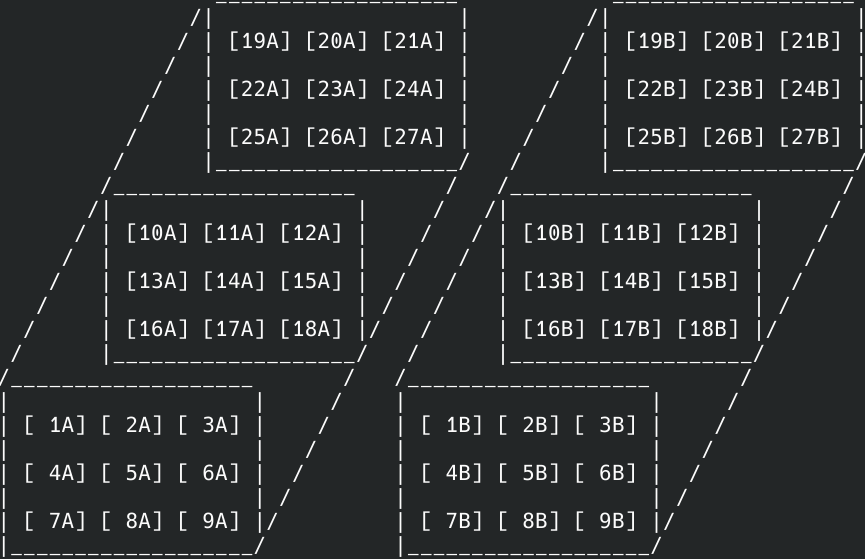
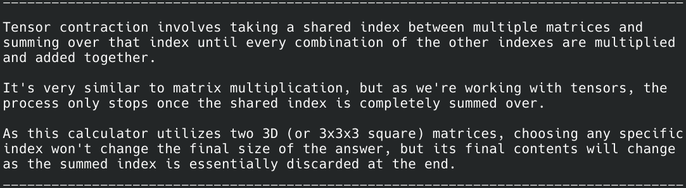

# 3D Tensor Contraction Operator
This calculator brings the idea of matrix multiplication to higher dimensions through tensor contraction. Here, two 3D (3x3x3) tensors of user-inputted values are "contracted" across at one or two common axes such that the result is a single tensor of lower order (in this case, a 2D tensor if two common axes are chosen) or a single tensor of higher order (in this case, a 4D tensor if only one common axis is chosen).1,2,3

  

# System Requirements
* C++98
    * (so really any version of C++)
    * (personally tested using C++23 with g++ compiler on Arch Linux 2025.07.01)
 
# Overview
### <ins> Applications of Tensor Contraction:</ins>
* Convolutional Neural Networks (CNNs) hold three dimensional pieces of data where a 3D tensor filter is contracted over patches of input images to make a single output value.4
* Tensor-network Quantum Circuits can be used to implement quantum computers. By treating a tensor as a quantum logic gate, one can contract networks of these gates, where each index is a qubit, to extract information.5
* For neuroscience, electroencephalography (EEG) and magnetoencephalography (MEG) techniques for brainwave analysis can be efficiently represented as multi-dimensional tensors where meaningful patters can be outputted via tensor contraction.6

### <ins> Project Summary:</ins>
This C++ program aims to implement the contraction operation through allowing the user to input a total of 54 integer values into two 3x3x3 tensors. From there, different combinations of the ***i,j,*** & ***k*** axes of each tensor can be chosen to be contracted over. In the code, maps are used in an attempt to efficiently organize all of the different possible contraction combinations the user may choose.

From here, the chosen axes to be contracted over are eliminated whilst the axes **not** contracted over undergo an operation akin to matrix multiplication:

  

# References
* 1['Introduction to Tensors: Tensor Product, Addition and Contraction of Tensors' - Alexander Fufaev (YouTube)](https://www.youtube.com/watch?v=uaZWADpdWuQ)
* 2['Basics of Tensor Computations' - Edgar Solomonik (PowerPoint, University of Illinois at Urbana-Champaign)](https://relate.cs.illinois.edu/course/cs598evs-f20/f/lectures/02-lecture.pdf)
* 3['Tensor Operations: Contractions, Inner Products, Outer Products' - Faculty of Khan (YouTube)](https://www.youtube.com/watch?v=fDcfqfWRIi8)
* 4['What are convolutional neural networks?' - IBM (Website Article)](https://www.ibm.com/think/topics/convolutional-neural-networks)
* 5['Tensor-network quantum circuits' - Diego Guala, et al. (Website Article)](https://pennylane.ai/qml/demos/tutorial_tn_circuits/)
* 6['Tensor-based preprocessing of combined EEG/MEG data' - Hanna Becker, et al. (IEEE paper)](https://ieeexplore.ieee.org/document/6333946)
